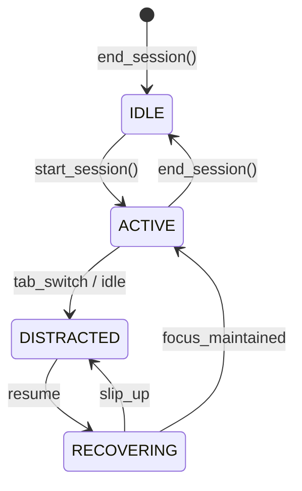

# FocusFlow 🧠

**Intelligent Productivity Engine with Real-Time Distraction Detection & AI Post-Mortems.**

FocusFlow is a professional-grade productivity suite designed for developers. It transcends traditional Pomodoro timers by actively monitoring user behavior, quantifying deep work through a biological state machine, and leveraging Large Language Models to generate predictive performance insights.

---

## 🚀 Key Features

### 📡 Real-Time Distraction Engine
A high-frequency monitoring system that tracks:
*   **Tab Switching:** Instant detection of context switching using the Page Visibility API.
*   **Idle Detection:** Automated tracking of inactivity via DOM event listeners.
*   **Biological State Machine:** Tracks transitions between `ACTIVE`, `DISTRACTED`, and `RECOVERING` states to calculate real-time Focus Scores.

### 🤖 AI Post-Session Post-Mortems
Upon session completion, the system aggregates tracking data and proxies it to an LLM (Claude/Llama) to generate:
*   **Actionable Feedback:** Identifying specific failure points and behavioral trends.
*   **Predictive Insights:** Suggestions for optimizing future focus blocks based on distraction history.

### 🔄 Intelligent Task Resurfacing
A persistence layer that tracks task abandonment. Tasks that are consistently neglected across multiple sessions are algorithmically flagged and resurfaced with high-priority visual markers.

### 🛠 Automated System Log
A real-time, immutable event log that records every architectural state transition and system event with precision timestamps.

---

## 🏗 Technical Architecture

### Tech Stack
*   **Frontend:** React (Vite), Custom Brutalist UI, `useNavigate` Routing, `DM Mono` Typography.
*   **Backend:** Python (FastAPI), High-performance Asynchronous Routing.
*   **Persistence:** SQLite with SQLAlchemy ORM.
*   **AI Overlay:** Anthropic API / Groq Inference.

### State Diagram
The engine utilizes a robust transition model to handle user behavior without redundant penalties:



---

## 🛠 Setup & Installation

### 1. External Engine Configuration
Create `backend/.env` with your LLM credentials:
```env
ANTHROPIC_API_KEY=your_key_here
```

### 2. Native Environment Setup
```powershell
# Backend
cd backend
python -m venv venv
.\venv\Scripts\activate # Windows
pip install -r requirements.txt
uvicorn main:app --reload

# Frontend
cd frontend
npm install
npm run dev
```

---

## 📎 Portfolio Context
FocusFlow was built to demonstrate architectural proficiency in **Full-Stack Engineering**, **State Management**, and **AI System Integration**. It focuses on solving the problem of "Attention Residue" through behavioral quantification.

Developed by **Arjun Varshney**.
