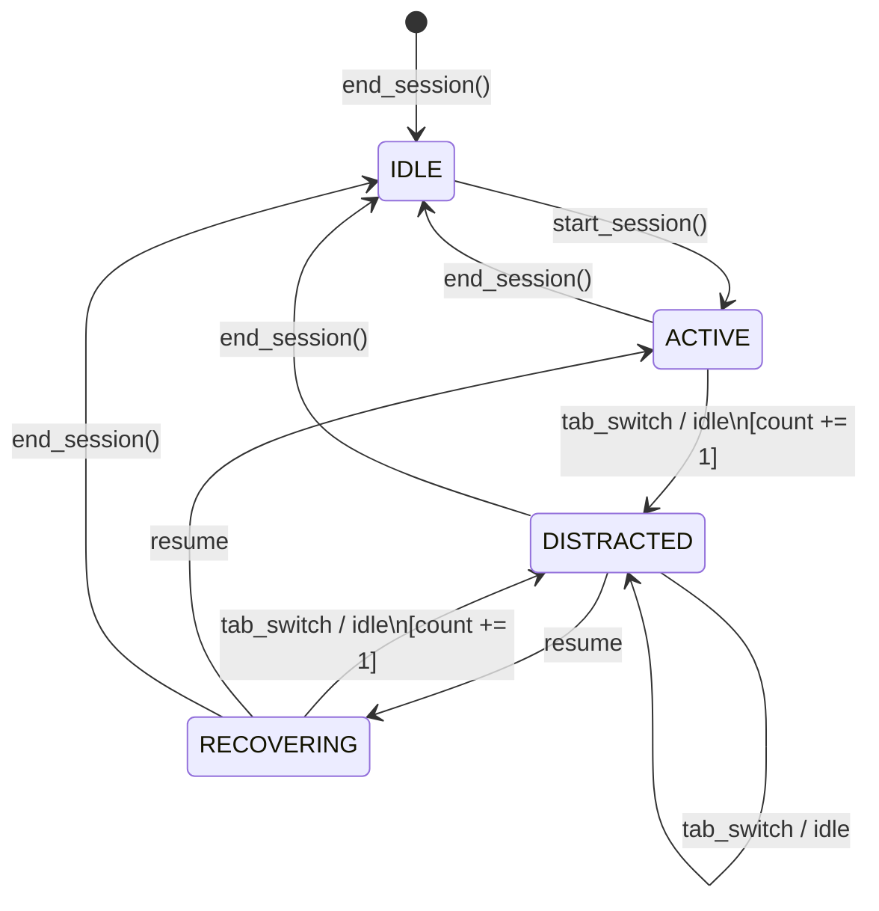

# FocusFlow

FocusFlow is a full-stack focus session tracker that detects distractions, scores your focus, and provides an AI-generated summary after every session. It's built to actually help you focus by holding you accountable and surfacing tasks that you repeatedly fail to complete.

## Problem Statement

*I always start a focus block intending to work on one thing, but quickly find myself checking other tabs, going idle, or getting distracted. I needed a tool that acts like a strict accountability partner, scores my focus based on actual behavior (tab switches and idling), and uses AI to give me actionable feedback at the end. FocusFlow tracks my distractions in real-time, penalizes my score, and forces me to confront tasks I keep avoiding.*

## Tech Stack

**Backend**: Python, FastAPI, SQLAlchemy, SQLite
**Frontend**: React (Vite), Tailwind CSS, Recharts, Axios
**AI**: Anthropic Claude API

## State Machine Architecture

The focus engine relies on a state machine to accurately track when you are distracted during a session without double-penalizing for continued distraction.



- When you start a session, it goes from `IDLE` to `ACTIVE`.
- If you switch tabs or go idle (>2 mins), you enter `DISTRACTED` and your distraction count goes up.
- If you resume focus, you enter `RECOVERING`. You must stay focused to return to `ACTIVE`.
- If you slip up again while `RECOVERING`, your distraction count goes up again.

## How to Run Locally

### 1. Backend Setup

```bash
cd backend
python -m venv venv

# Windows
.\venv\Scripts\activate
# Mac/Linux
source venv/bin/activate

pip install -r requirements.txt
```

Create a `.env` file in the `backend` directory and add your Anthropic API key:
```env
ANTHROPIC_API_KEY=your_key_here
```

Run the FastAPI server:
```bash
uvicorn main:app --reload
```
*The backend will run at http://localhost:8000*

### 2. Frontend Setup

```bash
cd frontend
npm install
npm run dev
```
*The frontend will run at http://localhost:5173*

## Screenshots

*(Insert screenshots of your dashboard and analytics here)*
